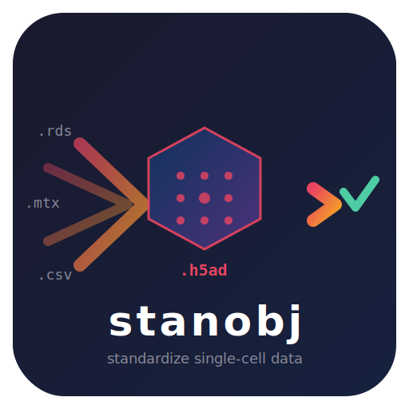

<p align="center">
  
</p>

<h1 align="center">stanobj</h1>

<p align="center">
  <strong>Standardize heterogeneous single-cell transcriptomics datasets into canonical <code>.h5ad</code></strong>
</p>

<p align="center">
  
  
  
  
</p>

---

## What is this?

**stanobj** is a data standardization tool (implemented as a [Claude Code](https://docs.anthropic.com/en/docs/claude-code) skill) that converts single-cell transcriptomics datasets from many source formats into a **canonical, analysis-ready `.h5ad`** representation.

This is **not** just file-format conversion. It is a **semantic harmonization** pipeline that:

- Detects and validates matrix orientation (cells x genes vs genes x cells)
- Classifies matrix content (raw counts, normalized, log1p, scaled)
- Standardizes cell and gene metadata with canonical column names
- Preserves all original information while adding structured provenance
- Surfaces ambiguities explicitly rather than guessing silently

## Supported Formats

| Format | Extension | Notes |
|--------|-----------|-------|
| Matrix Market / 10x | `.mtx`, directory | Auto-detects triplet structure |
| CSV | `.csv`, `.csv.gz` | Orientation heuristics + decision protocol |
| TSV | `.tsv`, `.tsv.gz` | Same as CSV with tab delimiter |
| 10x Genomics HDF5 | `.h5` | Reads `matrix/` group directly |
| Generic HDF5 | `.h5`, `.hdf5` | Inspects structure, asks if ambiguous |
| Existing h5ad | `.h5ad` | Re-standardization (not assumed canonical) |
| Loom | `.loom` | h5py-based reading |
| Seurat (R) | `.rds` | R subprocess, handles v5 + legacy |
| SingleCellExperiment (R) | `.rds` | R subprocess, auto-detected |

**Archives:** `.tar.gz`, `.tgz`, `.tar.bz2`, `.tar`, `.zip`
**Compression:** `.gz`, `.bz2` (transparent for most formats)

## How It Works

```
Input (any format)
  │
  ├── 1. Decompress / extract archives
  ├── 2. Auto-detect format
  ├── 3. Read with format-specific reader
  ├── 4. Classify matrix type (counts? normalized? scaled?)
  ├── 5. Check for mixed modalities (RNA vs ADT vs CRISPR)
  ├── 6. Standardize metadata (obs / var / obsm)
  ├── 7. Assign layers (counts → layers["counts"])
  ├── 8. Validate (structural + semantic checks)
  └── 9. Write canonical h5ad + report + audit log
```

When the pipeline encounters ambiguity (e.g., unclear matrix orientation, multiple Seurat assays), it **pauses and asks** rather than guessing.

## Usage

### As a Claude Code Skill

The skill is triggered automatically when you ask Claude Code to convert single-cell data:

> "Convert this Seurat RDS to h5ad"
> "Standardize these 10x files"
> "Convert expression.csv to canonical h5ad"

### Direct CLI

```bash
# Basic conversion
python stanobj.py <input> -o <output.h5ad>

# With explicit format
python stanobj.py data.h5 -o result.h5ad --format 10x_h5

# Supply decisions for ambiguous inputs
python stanobj.py data.csv -o result.h5ad \
  --decision matrix_orientation=cells_x_genes \
  --decision matrix_type=counts
```

### Exit Codes

| Code | Meaning |
|------|---------|
| `0` | Success. Outputs written. |
| `1` | Fatal error. |
| `10` | Decision needed. JSON on stdout with options. |

## Outputs

Each conversion produces three files:

```
output.h5ad              # Canonical AnnData
output_report.json       # Machine-readable conversion report
output_audit.log         # Human-readable audit log
```

### Canonical Schema

```python
adata.X                    # Main analysis matrix
adata.layers["counts"]     # Raw counts (when available)
adata.obs["cell_id"]       # Original cell barcode
adata.obs["dataset"]       # Dataset name
adata.obs["cell_type"]     # Standardized from celltype/CellType/annotation/...
adata.obs["sample"]        # Standardized from orig.ident/sample_id/...
adata.var["gene_symbol"]   # Gene symbols
adata.var["gene_id"]       # Ensembl IDs (when available)
adata.var["feature_type"]  # Gene Expression, Antibody Capture, etc.
adata.obsm["X_pca"]        # PCA embedding (when available)
adata.obsm["X_umap"]       # UMAP embedding (when available)
adata.uns["stanobj"]       # Full conversion provenance
```

## Decision Protocol

When stanobj can't proceed confidently, it exits with code 10 and emits structured JSON:

```json
{
  "status": "decision_needed",
  "decision_type": "assay_selection",
  "context": "Seurat object has 3 assays: RNA (32738), SCT (3000), ADT (142)",
  "options": ["RNA", "SCT", "ADT"],
  "recommendation": "RNA",
  "reason": "RNA has the most features and contains raw counts"
}
```

Known decision points:

| Type | Trigger |
|------|---------|
| `assay_selection` | Multiple assays in Seurat/SCE |
| `matrix_orientation` | Ambiguous CSV/TSV layout |
| `matrix_type` | Can't classify matrix confidently |
| `modality_filter` | Mixed RNA + non-RNA features |
| `format_detection` | Unrecognized file structure |

## Architecture

```
stanobj/
├── SKILL.md                 # Claude Code skill definition
├── scripts/
│   ├── stanobj.py           # Main orchestrator CLI
│   ├── detection.py         # Format detection + matrix classification
│   ├── validation.py        # Structural + semantic checks
│   ├── standardize.py       # Metadata harmonization
│   ├── report.py            # JSON report + audit log
│   ├── utils.py             # Compression, sampling, formatting
│   └── readers/
│       ├── mtx_reader.py    # Matrix Market / 10x triplet
│       ├── csv_reader.py    # CSV / TSV
│       ├── h5_reader.py     # 10x h5 + generic HDF5
│       ├── h5ad_reader.py   # Existing h5ad
│       ├── loom_reader.py   # Loom
│       ├── r_bridge.py      # Python-R bridge
│       ├── seurat_reader.R  # Seurat export
│       └── sce_reader.R     # SCE export
├── references/              # Schema docs, format guide
├── examples/                # Sample report
└── tests/                   # 198 tests
```

## Requirements

**Python:** anndata, scanpy, h5py, scipy, loompy, pandas, numpy

**R (optional, for Seurat/SCE):** Seurat, SeuratObject, SeuratDisk, SingleCellExperiment

If R is unavailable, stanobj provides manual conversion instructions as fallback.

## Related Tools

- **[stangene](https://github.com/chansigit/stangene)** — Gene identifier harmonization (Ensembl, symbols, aliases)
- Together: `stanobj` standardizes the container, `stangene` standardizes the gene identifiers

## License

MIT
